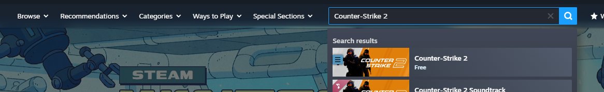
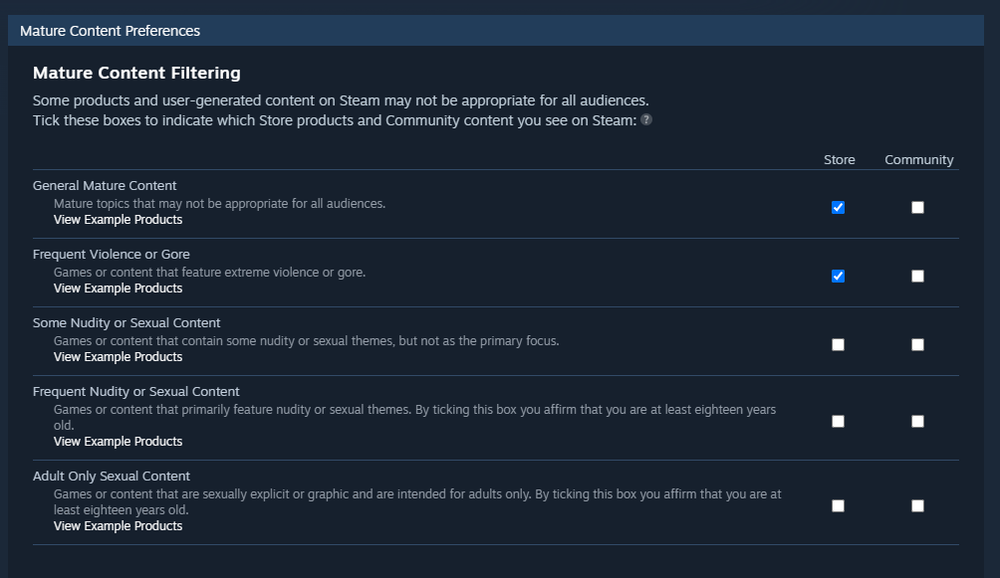
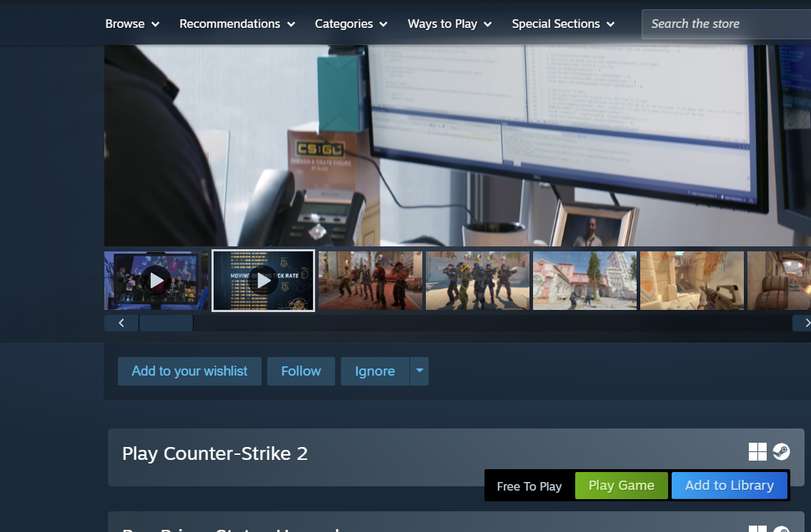
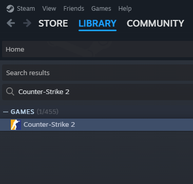
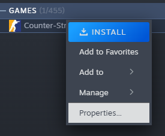
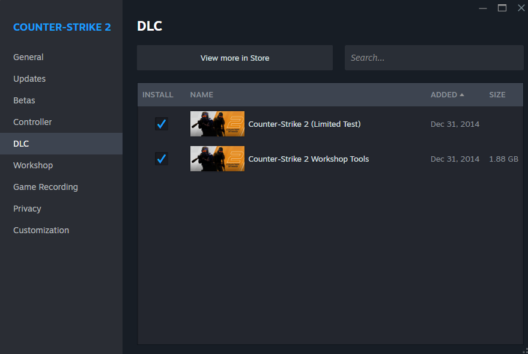
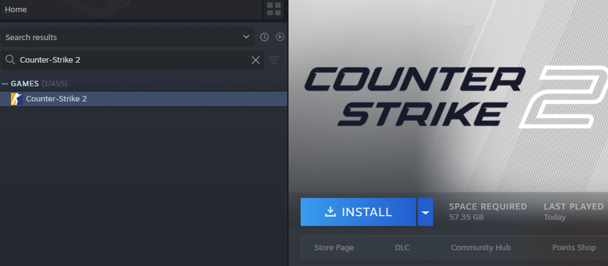
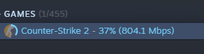
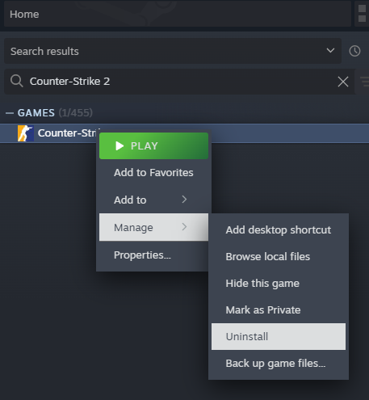
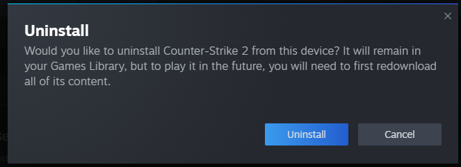

BS2 offers integration between tools used by the [Source 2 Engine](https://developer.valvesoftware.com/wiki/Source_2) and [Bevy Engine](https://bevy.org/). But before that, we first need to get these tools from somewhere! Unfortunately, there is no simple "press here to download all tools" kind of deal from Valve, at least not yet. Instead, the newest version of the Source 2 Tools are distributed with the game [Counter-Strike 2](https://www.counter-strike.net/cs2) (CS2). Fortunately for us, CS2 is free, so we can still relatively easily get access to the Tools through it.

Why do I need to click through this manually? Can't you automate it?

We could, but Valve really dislikes processes that allow you to download things by bypassing Steam. Maybe kicking off Steam over the command line would be fine, maybe it wouldn't. We don't know. To be on the safe side, we let users manually interact with Steam. Don't worry, it doesn't take long :)

The first step is to create an account for and download [Steam](https://store.steampowered.com/). Once we're running Steam, need to add CS2 to our library. If you already have it, please skip to the step where we enable the Workshop Tools. Otherwise, we open the tab labeled "STORE" and search for "Counter-Strike 2" in the search bar, then click on the first result. Alternatively, we can [use this link](https://store.steampowered.com/app/730/CounterStrike_2/).

Help, I only see Counter-Strike 2 Soundtrack!

Steam is probably filtering out CS2 due to your store preferences. Click on your username on the upper right, then click on "Store preferences". Ensure that at least the following two checkboxes are marked:

Then click yourself into any other view to save these settings, e.g. by clicking on "STORE" in the menu bar. Now try again.

If you're sensitive to the categories we just enabled, be warned that the videos playing automatically in the Store page feature simulated, fictional depictions of violence and blood. Beyond that, we don't actually need to run CS2 once, so you won't be forced to interact with these themes any further than that. After the BS2 setup, you can safely uninstall CS2 again and revert these filtering changes to a level that you're more comfortable with.

Once we're on the correct Steam page, we scroll down to where it says "Free To Play", and click on "Add to Library".

If all went well, we should be greeted by this message:

Now, we need to click on "LIBRARY" in the menu bar. In our library, we search for "Counter-Strike 2", which should find the game for us.

We then right-click the game entry and select "Properties..."

In the popup greeting us, we enter the tab "DLC" and enable "Counter-Strike 2 Workshop Tools". Just as CS2 itself, this option is free, and is what gives us the actual Source 2 Tools we need. You can ignore all other DLC options; it doesn't matter whether they're on or off.

Now we are ready to install CS2. Close this popup menu, then left-click the entry "Counter-Strike 2" in our library list on the left. That make the right side of the window show a banner for the game, as well as a big "INSTALL" button. We click on it now.

In the install dialog, you can configure some things, but we will go ahead with the default settings. We click on the "Install" button to start the process.

This will start the download process. We can see how far we are on the library entry on the left:

We'll need to wait a bit until this is done. Depending on your internet connection, this may take a while. After all, it's more than 50 gigabytes of data. If storage space is tight, don't worry, we can safely delete most of this after the setup is done. BS2 only requires about 1.5 Gigabyte to work.

Why do I need to download 50 gigabytes only to throw them away?

Because there is currently no known way to download the Workshop Tools DLC containing the Source 2 Tools we need without also installing a game with it. Since CS2 is both free *and* the game that delivers the tools to us, it's the candidate of choice. But yes, sadly this means we have to download the entirety of CS2 for nothing.

When the download is done, we can start BS2 and perform the one-time installation. See the [top-level docs](../readme.md) for more information about how to proceed. 

After the BS2 setup is done, we don't need CS2 anymore. We can delete Counter-Strike 2 by right-clicking its library entry again, just as when we wanted to configure its properties, but this time select "Manage" followed by "Uninstall".

And then finally confirm our decision in the popup that follows.

